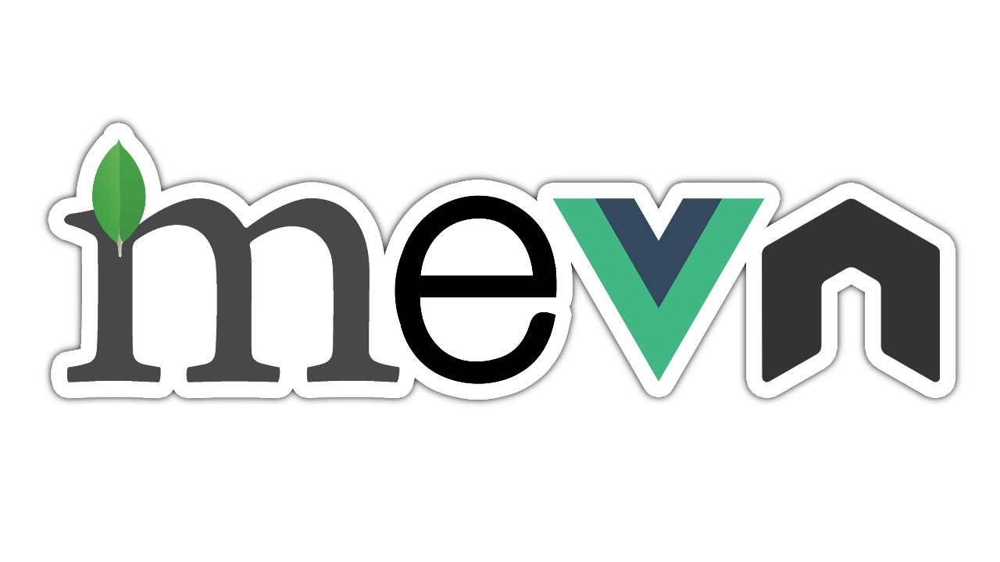

# Meetup-with-Vue
Meetup social network app with Vue.js Vuex Node Express MongoDB (MEVN) and Vuetify and SASS for the styling  



## Preview (GIF)  


## Project setup
Download or clone this repository.  
Go to the project directory and run the **backend** with these commands in a terminal:  

Install the dependencies:  

```
npm install
```
and  
```
npm start
```

and now to run the **client side** go to the client directory and run the same commands as before.

